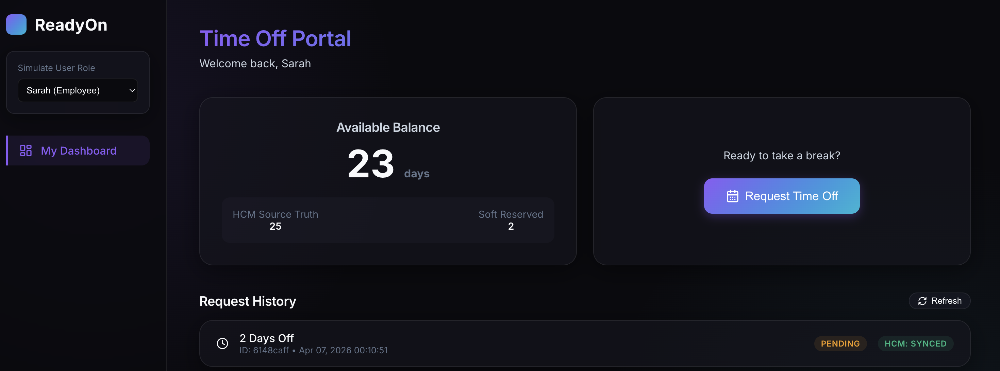
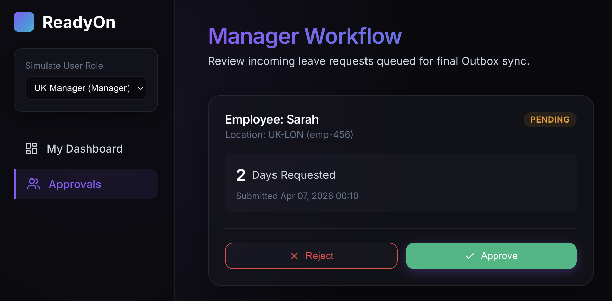
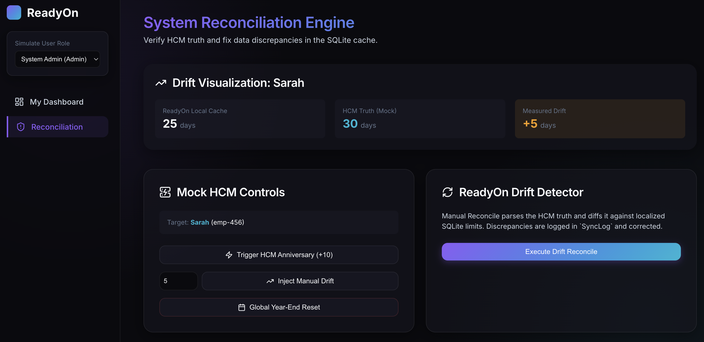

# ReadyOn Time-Off Microservice

A full-stack microservice that manages the lifecycle of employee time-off requests while maintaining balance integrity with an external Human Capital Management (HCM) system.

**Built with:** NestJS (TypeScript) · React 19 · SQLite · TypeORM

<br/>

<p align="center">
  <br/>
  <em>Employee view</em>
</p>

<br/>

<p align="center">
  <br/>
  <em>Manager view</em>
</p>

<br/>

<p align="center">
  <br/>
  <em>Admin view</em>
</p>

<br/>

---

## Table of Contents

1. [Quick Start](#quick-start)
2. [Project Structure](#project-structure)
3. [How It Works (Plain English)](#how-it-works-plain-english)
4. [Engineering Specification (TRD)](#engineering-specification-trd)
   - [Problem Statement](#1-problem-statement)
   - [Challenges](#2-challenges)
   - [Proposed Solution](#3-proposed-solution)
   - [Architecture Deep Dive](#4-architecture-deep-dive)
   - [Data Model](#5-data-model)
   - [Sync Strategies](#6-sync-strategies)
   - [Alternatives Considered](#7-alternatives-considered)
   - [Trade-offs & Limitations](#8-trade-offs--limitations)
5. [API Reference](#api-reference)
6. [Test Suite & Coverage](#test-suite--coverage)
7. [Agentic Development Notes](#agentic-development-notes)

---

## Quick Start

### Prerequisites

- **Node.js** v18+ and **npm**
- No database setup needed — SQLite is embedded and auto-created

### 1. Start the Backend (two processes)

```bash
cd backend
npm install

Run both Main API server (port 3000) and Mock HCM server (port 3001):

npm run dev:all
```

### 2. Start the Frontend

```bash
cd frontend
npm install
npm start
```

Open [http://localhost:3000](http://localhost:3000) in your browser.

### 3. Run Tests

```bash
# Backend unit tests
cd backend && npx jest --verbose

# Backend E2E tests (make sure ports 3001/8080 are free)
cd backend && npx jest --config test/jest-e2e.json --verbose

# Frontend component tests
cd frontend && npm test
```

---

## Project Structure

```
ready-on-time-off-microservice/
├── backend/
│   ├── src/
│   │   ├── main.ts                          # API server entry (port 8080)
│   │   ├── app.module.ts                    # Root module wiring
│   │   ├── database.module.ts               # SQLite + TypeORM config
│   │   ├── hcm-mock/                        # 🏭 Standalone Mock HCM Server
│   │   │   ├── main.mock.ts                 #   Entry point (port 3001)
│   │   │   ├── hcm.service.ts               #   In-memory balance store
│   │   │   └── hcm.controller.ts            #   REST endpoints
│   │   └── modules/
│   │       ├── timeoff/                     # 📋 Request lifecycle (CRUD)
│   │       │   ├── entities/                #   TimeOffRequest, Employee, Location
│   │       │   ├── timeoff.controller.ts    #   REST: /requests
│   │       │   └── timeoff.service.ts       #   Submit, approve, reject, cancel
│   │       ├── balance/                     # 💰 Balance management
│   │       │   ├── entities/                #   LeaveBalance
│   │       │   ├── balance.controller.ts    #   REST: /balances
│   │       │   ├── balance.service.ts       #   Cache-aside reads, validation
│   │       │   └── balance.service.spec.ts  #   Unit tests
│   │       ├── hcm-sync/                    # 🔄 All HCM communication
│   │       │   ├── hcm-client.service.ts    #   HTTP client to Mock HCM
│   │       │   ├── hcm-webhook.controller.ts#   Inbound: /hcm/webhook, /hcm/batch-sync
│   │       │   ├── batch-sync.service.ts    #   Idempotent batch processing
│   │       │   └── sync-outbox.cron.ts      #   ⏰ Cron: outbox drain every 10s
│   │       └── admin/                       # 🛠 Reconciliation engine
│   │           ├── entities/                #   SyncLog, SyncEvent
│   │           ├── admin.controller.ts      #   REST: /admin/reconcile, /admin/compare
│   │           └── reconciliation.service.ts#   Drift detection + correction
│   └── test/
│       └── app.e2e-spec.ts                  # Full integration test suite
│
├── frontend/
│   └── src/
│       ├── App.tsx                          # Router setup
│       ├── api/apiClient.ts                 # Axios clients + DTO types
│       ├── context/ActorContext.tsx          # Role switcher state
│       └── components/
│           ├── Layout.tsx                   # Sidebar + navigation
│           ├── EmployeeDashboard.tsx         # "My Dashboard" — balance + requests
│           ├── ManagerDashboard.tsx          # Approve/reject pending requests
│           └── AdminDashboard.tsx           # Drift visualization + reconcile
```

---

## How It Works (Plain English)

Think of the system as **two separate worlds** that need to stay in sync:

1. **The HCM** (Human Capital Management — like Workday) — This is the "source of truth" for how many days off an employee actually has. We don't control it.
2. **ReadyOn** (our microservice) — This is the app employees use day-to-day. It keeps a **local copy** of balances in SQLite so employees get instant responses.

### The Core Problem

When Sarah requests 2 days off on ReadyOn, we need to:

- Check she has enough days (instantly, from our local cache)
- "Reserve" those days so no one else can double-book them
- Eventually tell the HCM "hey, deduct 2 days from Sarah"
- Handle the case where the HCM independently changes Sarah's balance (e.g., work anniversary bonus)

### How Data Flows

**Employee submits a request →** ReadyOn reserves days locally in SQLite → Manager approves → A background cron job picks up the approval and sends it to the HCM → HCM confirms → Done.

**HCM changes a balance independently →** HCM sends a webhook to ReadyOn → ReadyOn updates its local cache → If the numbers don't match, it logs a "drift" event.

**Something goes wrong →** Admin opens the Reconciliation dashboard → Clicks "Execute Drift Reconcile" → System compares local cache vs HCM truth → Auto-corrects any differences.

---

## Engineering Specification (TRD)

### 1. Problem Statement

ReadyOn's Time-Off module serves as the primary interface for employees to request time off. However, the HCM system remains the "Source of Truth" for employment data. The fundamental challenge is **keeping balances synchronized between two independent systems** that can both mutate the same data.

#### User Personas

| Persona      | Need                                       | System Behavior                                                |
| ------------ | ------------------------------------------ | -------------------------------------------------------------- |
| **Employee** | See accurate balance, get instant feedback | Cache-aside reads from SQLite; sub-millisecond balance lookups |
| **Manager**  | Approve requests knowing data is valid     | Local balance validation + pessimistic soft-reservation        |
| **Admin**    | Detect and fix data discrepancies          | Drift detection engine with full audit trail                   |

---

### 2. Challenges

#### Challenge 1: External Mutations to Balance

The HCM isn't just a passive database — it actively changes balances. Work anniversaries, year-end resets, and manual HR adjustments all happen **outside ReadyOn's control**.

**Example scenario:** Sarah has 20 days in both systems. The HCM awards her 10 bonus days for her work anniversary. ReadyOn still thinks she has 20. If Sarah tries to request 25 days, ReadyOn would incorrectly reject her.

#### Challenge 2: Unreliable Network Between Systems

HCM APIs are not guaranteed to be available. The mock HCM simulates this with a configurable error rate:

```typescript
// backend/src/hcm-mock/hcm.service.ts
private simulateFailure() {
  const errorRate = parseFloat(process.env.HCM_ERROR_RATE || '0.1'); // 10% default
  if (Math.random() < errorRate) {
    this.logger.warn('Mock HCM randomly failing to simulate unreliable network');
    throw new InternalServerErrorException('HCM System Unavailable');
  }
}
```

Every read and write to the mock HCM passes through `simulateFailure()`. This means our system must handle transient 500 errors gracefully — retrying operations that fail due to network issues while permanently failing operations rejected by business logic (400 errors).

#### Challenge 3: Double-Booking / Race Conditions

If Sarah has 10 days available and submits two 8-day requests simultaneously, we must not approve both. Without proper concurrency control, the system could over-commit her balance.

#### Challenge 4: Data Consistency Without Distributed Transactions

We cannot use a distributed transaction across ReadyOn's SQLite and the HCM. We need eventual consistency — the local cache and HCM must converge to the same state, even if they temporarily disagree.

#### Challenge 5: Idempotent Processing

HCM batch syncs and webhooks may be delivered more than once. Processing the same event twice could corrupt balances (e.g., double-crediting an anniversary bonus).

---

### 3. Proposed Solution

The system is built around three core patterns:

#### Pattern 1: Cache-Aside with Soft Reservation

ReadyOn maintains a **local SQLite cache** of balances. On first access, it pulls from HCM and caches locally. All subsequent reads are local. When a request is submitted, days are "soft reserved" — deducted from the available pool but not yet committed to the HCM.

```typescript
// backend/src/modules/balance/balance.service.ts
async getAvailableBalance(employeeId: string, locationId: string) {
  let balanceRecord = await this.balanceRepo.findOne({
    where: { employeeId, locationId },
  });

  if (!balanceRecord) {
    // Cache miss — pull from HCM and store locally
    const hcmData = await this.hcmClient.fetchBalance(employeeId, locationId);
    balanceRecord = this.balanceRepo.create({
      employeeId, locationId,
      balanceDays: hcmData.balanceDays ?? 0,
      reservedDays: 0,
    });
    await this.balanceRepo.save(balanceRecord);
  }

  const available = Number(balanceRecord.balanceDays) - Number(balanceRecord.reservedDays);
  return { availableDays: available, balanceDays: ..., reservedDays: ... };
}
```

The `reservedDays` field is the key innovation. It acts as a **pessimistic lock** on the balance: when a request is submitted, we increment `reservedDays`, reducing the available pool without touching the actual balance.

#### Pattern 2: Transactional Outbox for HCM Writes

Approved requests don't immediately call the HCM. Instead, they're marked `PENDING_SYNC` and a **cron job** drains the outbox every 10 seconds:

```typescript
// backend/src/modules/hcm-sync/sync-outbox.cron.ts
@Cron(CronExpression.EVERY_10_SECONDS)
async handleCron() {
  const pendingRequests = await this.requestRepo.find({
    where: { hcmSyncStatus: HcmSyncStatus.PENDING_SYNC },
    take: 50,
  });

  for (const request of pendingRequests) {
    try {
      if (request.status === TimeOffRequestStatus.APPROVED) {
        await this.hcmClient.deductBalance(request.employeeId, request.locationId, Number(request.daysRequested));
      } else if (request.status === TimeOffRequestStatus.CANCELLED) {
        await this.hcmClient.deductBalance(request.employeeId, request.locationId, -Number(request.daysRequested));
      }
      request.hcmSyncStatus = HcmSyncStatus.SYNCED;
      await this.requestRepo.save(request);
    } catch (e: any) {
      const isBadRequest = e.response?.status === 400;
      if (isBadRequest) {
        // Business logic rejection — permanent failure
        request.hcmSyncStatus = HcmSyncStatus.FAILED;
        await this.requestRepo.save(request);
      } else {
        // Transient error — leave as PENDING_SYNC for retry
        this.logger.warn(`Transient Failure syncing ${request.id}. Will retry.`);
      }
    }
  }
}
```

**Key design decisions in this cron:**

- **Transient vs. permanent failures:** 500 errors are retried automatically on the next cron tick. 400 errors (insufficient balance in HCM) are marked `FAILED` permanently.
- **Batch size limit:** `take: 50` prevents a thundering herd if thousands of requests queue up.
- **Cancellation handling:** Cancelled requests send a negative deduction (credit) to the HCM.

#### Pattern 3: Bidirectional Drift Detection

The HCM can push changes to ReadyOn via two channels:

**Webhooks** (real-time, event-driven): When the HCM changes a balance (anniversary, manual HR adjustment), it sends a webhook. ReadyOn processes it immediately:

```typescript
// backend/src/modules/hcm-sync/batch-sync.service.ts
async handleWebhook(payload: any) {
  if (payload.eventType === 'ANNIVERSARY_CREDIT' || payload.eventType === 'MANUAL_ADJUSTMENT') {
    await this.reconciliationService.detectDrift(
      payload.employeeId, payload.locationId,
      SyncSource.HCM_WEBHOOK, payload.balanceDays
    );
  }
  return { success: true };
}
```

**Batch sync** (bulk, periodic): The HCM can push its entire corpus of balances. This is idempotent — duplicate `syncEventId` values are rejected:

```typescript
// backend/src/modules/hcm-sync/batch-sync.service.ts
async applyIdempotentUpdate(syncEventId: string, payload: Array<...>) {
  const existing = await this.syncEventRepo.findOne({ where: { id: syncEventId } });
  if (existing) {
    return { skipped: true, reason: 'Duplicate syncEventId' };
  }
  // Process each record through drift detection...
  await this.syncEventRepo.save({ id: syncEventId });
}
```

The `SyncEvent` entity stores processed event IDs — if the same batch is delivered twice, the second delivery is silently skipped.

---

### 4. Architecture Deep Dive

```
┌─────────────────────────────────────────────────────────────────────┐
│                        FRONTEND (React 19)                         │
│                        Port 3000                                   │
│  ┌───────────────┐  ┌──────────────────┐  ┌─────────────────────┐  │
│  │ Employee      │  │ Manager          │  │ Admin               │  │
│  │ Dashboard     │  │ Dashboard        │  │ Dashboard           │  │
│  │ - Balance     │  │ - Pending queue  │  │ - Drift viz         │  │
│  │ - Request     │  │ - Approve/Reject │  │ - Mock HCM controls│  │
│  │ - History     │  │                  │  │ - Reconcile engine  │  │
│  └───────┬───────┘  └────────┬─────────┘  └─────────┬───────────┘  │
│          │                   │                      │              │
│          └───────────────────┼──────────────────────┘              │
│                              │ Axios HTTP                          │
└──────────────────────────────┼─────────────────────────────────────┘
                               │
            ┌──────────────────▼──────────────────┐
            │        READYON API (NestJS)          │
            │            Port 8080                 │
            │                                      │
            │  ┌──────────┐  ┌─────────────────┐   │
            │  │ /requests│  │ /balances        │   │
            │  │ CRUD +   │  │ Cache-aside      │   │
            │  │ lifecycle │  │ reads            │   │
            │  └────┬─────┘  └────────┬─────────┘   │
            │       │                 │              │
            │  ┌────▼─────────────────▼──────────┐   │
            │  │         SQLite (TypeORM)         │   │
            │  │  leave_balances                  │   │
            │  │  time_off_requests               │   │
            │  │  sync_logs / sync_events         │   │
            │  └──────────────────────────────────┘   │
            │                                         │
            │  ┌──────────────────────────────────┐   │
            │  │   Outbox Cron (every 10s)        │   │
            │  │   Drains PENDING_SYNC → HCM      │───┼──►  HCM Writes
            │  └──────────────────────────────────┘   │
            │                                         │
            │  ┌──────────────────────────────────┐   │
            │  │   /hcm/webhook                   │◄──┼───  HCM Pushes
            │  │   /hcm/batch-sync                │   │
            │  │   Inbound event processing       │   │
            │  └──────────────────────────────────┘   │
            │                                         │
            │  ┌──────────────────────────────────┐   │
            │  │   /admin/reconcile               │   │
            │  │   /admin/compare                 │   │
            │  │   Drift detection engine         │   │
            │  └──────────────────────────────────┘   │
            └─────────────────────────────────────────┘
                               │
                               │  HTTP (Axios)
                               ▼
            ┌─────────────────────────────────────────┐
            │       MOCK HCM SERVER (NestJS)          │
            │            Port 3001                     │
            │                                          │
            │  In-memory Map<employeeId, HcmBalance>   │
            │                                          │
            │  Simulates:                              │
            │  • Balance reads/writes                  │
            │  • Configurable error rate (10% default) │
            │  • Anniversary credits (+10 days)        │
            │  • Year-end resets (→ 30 days)           │
            │  • Manual balance adjustments            │
            │  • Webhook push to ReadyOn               │
            │  • Batch sync push to ReadyOn            │
            └─────────────────────────────────────────┘
```

#### Request Lifecycle State Machine

```
          ┌─────────┐
          │ PENDING  │ ← Employee submits (reservedDays += N)
          └────┬─────┘
               │
        ┌──────┴──────┐
        ▼             ▼
  ┌──────────┐  ┌──────────┐
  │ APPROVED │  │ REJECTED │  ← Manager action
  └────┬─────┘  └──────────┘    (REJECTED: reservedDays -= N)
       │
       │  hcmSyncStatus: PENDING_SYNC
       │  Outbox cron picks up...
       │
       ├── Success → SYNCED
       └── 400 error → FAILED

  At any point: Employee can CANCEL
  CANCELLED + was PENDING  → reservedDays -= N
  CANCELLED + was APPROVED → balanceDays += N (refund)
```

---

### 5. Data Model

#### `leave_balances` — The Local Cache

| Column         | Type    | Purpose                                         |
| -------------- | ------- | ----------------------------------------------- |
| `employeeId`   | varchar | Employee identifier                             |
| `locationId`   | varchar | Geographic dimension (e.g., `UK-LON`)           |
| `balanceDays`  | decimal | Total days available (mirrors HCM truth)        |
| `reservedDays` | decimal | Days soft-locked by pending/submitted requests  |
| `version`      | integer | Optimistic concurrency control (auto-increment) |

**Key constraint:** `UNIQUE(employeeId, locationId)` — one balance per employee per location.

The `version` column uses TypeORM's `@VersionColumn()` for optimistic locking. If two concurrent transactions try to update the same balance, the second one gets a version conflict error.

```typescript
// backend/src/modules/balance/entities/leave-balance.entity.ts
@Entity("leave_balances")
@Unique(["employeeId", "locationId"])
export class LeaveBalance {
  @PrimaryGeneratedColumn("uuid")
  id: string;

  @Column({ type: "decimal", precision: 10, scale: 2, default: 0 })
  balanceDays: number;

  @Column({ type: "decimal", precision: 10, scale: 2, default: 0 })
  reservedDays: number;

  @VersionColumn()
  version: number;
}
```

#### `time_off_requests` — Request Lifecycle

| Column          | Type     | Purpose                                           |
| --------------- | -------- | ------------------------------------------------- |
| `status`        | enum     | `PENDING` · `APPROVED` · `REJECTED` · `CANCELLED` |
| `hcmSyncStatus` | enum     | `PENDING_SYNC` · `SYNCED` · `FAILED`              |
| `daysRequested` | decimal  | Number of days                                    |
| `createdAt`     | datetime | Auto-generated timestamp                          |

The `hcmSyncStatus` is the outbox flag. The cron job queries for `PENDING_SYNC` records and tries to push them to the HCM.

#### `sync_logs` — Full Audit Trail

Every drift detection, reconciliation, and balance correction is logged:

```typescript
// backend/src/modules/admin/entities/sync-log.entity.ts
export enum SyncSource {
  HCM_BATCH = "HCM_BATCH",
  HCM_WEBHOOK = "HCM_WEBHOOK",
  HCM_REALTIME = "HCM_REALTIME",
  LOCAL_REQUEST = "LOCAL_REQUEST",
  ADMIN_RECONCILE = "ADMIN_RECONCILE",
}
```

This enables forensic debugging — you can trace exactly when a balance changed, why, and through which channel.

#### `sync_events` — Idempotency Guard

A simple table with one column: the event ID. Before processing a batch sync, we check if the `syncEventId` already exists. If it does, skip.

---

### 6. Sync Strategies

The system uses **three complementary strategies** to keep data in sync. Each handles a different failure mode:

| Strategy            | Direction     | Trigger               | Latency   | Use Case                      |
| ------------------- | ------------- | --------------------- | --------- | ----------------------------- |
| **Cache-Aside**     | ReadyOn → HCM | On first balance read | ~100ms    | Cold-start population         |
| **Outbox Cron**     | ReadyOn → HCM | Every 10 seconds      | ≤10s      | Approved request deductions   |
| **Webhook**         | HCM → ReadyOn | On HCM event          | Real-time | Anniversary, adjustments      |
| **Batch Sync**      | HCM → ReadyOn | On HCM push           | Bulk      | Year-end resets, full refresh |
| **Admin Reconcile** | Bidirectional | Manual trigger        | On-demand | Debugging, drift correction   |

#### How Drift Detection Works

The `ReconciliationService.detectDrift()` method is the heart of the system. It's called by webhooks, batch syncs, and the admin panel:

```typescript
// backend/src/modules/admin/reconciliation.service.ts
async detectDrift(employeeId, locationId, source, providedHcmBalance?) {
  // 1. Get HCM truth (either passed in or fetched live)
  let hcmBalanceDays = providedHcmBalance;
  if (hcmBalanceDays === undefined) {
    const hcmData = await this.hcmClient.fetchBalance(employeeId, locationId);
    hcmBalanceDays = hcmData.balanceDays;
  }

  // 2. Compare against local cache inside a transaction
  const localRecord = await queryRunner.manager.findOne(LeaveBalance, {
    where: { employeeId, locationId }
  });

  const previousBalance = localRecord ? Number(localRecord.balanceDays) : 0;
  const diff = Number(hcmBalanceDays) - previousBalance;

  if (diff !== 0 || !localRecord) {
    // 3. Drift detected — correct local cache
    localRecord.balanceDays = hcmBalanceDays;
    await queryRunner.manager.save(LeaveBalance, localRecord);

    // 4. Critical check: balance - reserved < 0 means over-committed
    const isCritical = (balanceDays - reservedDays) < 0;

    // 5. Log everything for audit trail
    await queryRunner.manager.save(SyncLog, {
      employeeId, source,
      action: isCritical ? 'CRITICAL_DRIFT_DETECTED' : 'UPDATE_FROM_DRIFT',
      delta: diff, previousBalance, newBalance: hcmBalanceDays
    });

    return { reconciled: true, delta: diff, critical: isCritical };
  }

  return { reconciled: false, delta: 0 };
}
```

**Critical drift** occurs when an HCM balance drop puts `balanceDays - reservedDays < 0`. This means the employee has pending requests that exceed their actual entitlement — the admin should review immediately.

---

### 7. Alternatives Considered

#### Why SQLite Instead of PostgreSQL/MySQL?

| Factor               | SQLite                              | PostgreSQL               |
| -------------------- | ----------------------------------- | ------------------------ |
| Setup complexity     | Zero — file-based                   | Requires server install  |
| Demo portability     | `git clone && npm start`            | Docker or cloud instance |
| Concurrency          | Single-writer (sufficient for demo) | Full MVCC                |
| Production readiness | ❌ Not suitable                     | ✅ Production-ready      |

**Decision:** SQLite was chosen for **demo portability**. The entire app runs with `npm install && npm start` — no Docker, no database server. The TypeORM abstraction means swapping to PostgreSQL in production is a config change:

```typescript
// database.module.ts — swap 'sqlite' for 'postgres', add connection string
TypeOrmModule.forRoot({
  type: "sqlite", // ← change to 'postgres'
  database: "data/db.sqlite", // ← change to connection URL
  synchronize: true, // ← off in production, use migrations
});
```

#### Why Outbox Pattern Instead of Synchronous HCM Calls?

**Alternative: Direct synchronous call on approval**

```
Manager approves → API calls HCM.deduct() → waits for response → returns
```

**Problem:** If the HCM is down (simulated at 10% failure rate), the approval fails entirely. The manager has to retry manually. Poor UX.

**Chosen: Outbox pattern**

```
Manager approves → marks PENDING_SYNC → returns immediately → cron retries
```

**Advantage:** The manager always gets instant feedback. HCM communication is decoupled and automatically retried. Our E2E chaos test proves this works under 50% failure rates.

#### Why Cron-Based Outbox Instead of Message Queue?

| Factor          | Cron (chosen)            | RabbitMQ/SQS               |
| --------------- | ------------------------ | -------------------------- |
| Infrastructure  | None — built into NestJS | Separate service to manage |
| Ordering        | Sequential by query      | Requires careful ordering  |
| Exactly-once    | Via DB status flags      | Built-in (with config)     |
| Scale           | Single instance          | Multi-consumer             |
| Demo simplicity | ✅                       | ❌ Overkill for scope      |

**Decision:** For a microservice handling moderate request volume, a cron polling the database every 10 seconds is simple, debuggable, and sufficient. In production at scale, we'd migrate to a proper message queue.

#### Why Pessimistic Soft-Reservation Instead of Optimistic?

**Optimistic:** Let the request through, validate at sync time. Risk: user sees "approved" but HCM later rejects.

**Pessimistic (chosen):** Reserve days immediately on submission. The `reservedDays` field prevents two requests from consuming the same pool.

```typescript
// backend/src/modules/timeoff/timeoff.service.ts — submitRequest()
const available = Number(balance.balanceDays) - Number(balance.reservedDays);
if (available < daysRequested) {
  throw new BadRequestException("Insufficient balance available locally");
}

// Soft reserve
balance.reservedDays = Number(balance.reservedDays) + daysRequested;
await queryRunner.manager.save(LeaveBalance, balance);
```

This entire operation runs inside a `DataSource.createQueryRunner()` transaction, preventing race conditions.

---

### 8. Trade-offs & Limitations

| Trade-off                                        | Rationale                                                                                                            |
| ------------------------------------------------ | -------------------------------------------------------------------------------------------------------------------- |
| **Eventual consistency** over strong consistency | HCM can't participate in distributed transactions. We accept a brief window where local and HCM balances may differ. |
| **Polling cron** over event-driven outbox        | Simpler to implement and debug. Adds up to 10s latency to HCM writes.                                                |
| **SQLite** over a production DB                  | Demo portability. TypeORM abstraction makes migration trivial.                                                       |
| **No authentication**                            | Scope decision. Actor/role switching is simulated via dropdown. In production, this would be OAuth2/OIDC.            |
| **In-memory mock HCM**                           | Resets on restart. Acceptable for demo — proves the integration patterns work.                                       |
| **No rate limiting**                             | Not implemented for demo scope. Production would need it on the outbox cron.                                         |

#### Known Limitations

1. **Single-instance only:** The cron job assumes a single ReadyOn instance. Multiple instances would double-process the outbox. Solution: distributed lock (e.g., Redis `SETNX`) or leader election.
2. **No partial-day requests:** The system supports decimal days but the UI only accepts integers.
3. **No date ranges:** Requests are "N days off" rather than "March 15–17." A production system would need calendar integration.
4. **Cron restart gap:** If the server restarts, any `PENDING_SYNC` items wait until the cron runs again (up to 10s). No data loss, just delayed sync.

---

## API Reference

### Time-Off Requests

| Method   | Endpoint                          | Description                   |
| -------- | --------------------------------- | ----------------------------- |
| `POST`   | `/requests`                       | Submit a new time-off request |
| `GET`    | `/requests?employeeId=X&status=Y` | List requests (filterable)    |
| `GET`    | `/requests/:id`                   | Get single request            |
| `POST`   | `/requests/:id/approve`           | Manager approves              |
| `POST`   | `/requests/:id/reject`            | Manager rejects               |
| `DELETE` | `/requests/:id`                   | Cancel a request              |

### Balances

| Method | Endpoint                            | Description                         |
| ------ | ----------------------------------- | ----------------------------------- |
| `GET`  | `/balances/:employeeId/:locationId` | Get available balance (cache-aside) |

### HCM Integration (Inbound)

| Method | Endpoint          | Description                          |
| ------ | ----------------- | ------------------------------------ |
| `POST` | `/hcm/batch-sync` | Receive bulk balance update from HCM |
| `POST` | `/hcm/webhook`    | Receive real-time event from HCM     |

### Admin

| Method | Endpoint                       | Description                          |
| ------ | ------------------------------ | ------------------------------------ |
| `GET`  | `/admin/compare/:empId/:locId` | View local vs HCM balance comparison |
| `POST` | `/admin/reconcile`             | Trigger drift detection + correction |

### Mock HCM Server (port 3001)

| Method | Endpoint                               | Description                  |
| ------ | -------------------------------------- | ---------------------------- |
| `GET`  | `/mock-hcm/balances/:empId/:locId`     | Read HCM balance             |
| `POST` | `/mock-hcm/balances/deduct`            | Deduct from HCM              |
| `POST` | `/mock-hcm/trigger/anniversary/:empId` | Simulate +10 day bonus       |
| `POST` | `/mock-hcm/trigger/year-reset`         | Reset all balances to 30     |
| `POST` | `/mock-hcm/trigger/batch`              | Push all balances to ReadyOn |
| `POST` | `/mock-hcm/trigger/adjust`             | Inject arbitrary drift       |

---

## Test Suite & Coverage

### Testing Strategy

The test suite is designed around the principle that **agentic development demands rigorous testing** — since the code was generated by AI, the tests are the primary quality gate. We maintain a high-rigidity suite with **217 total automated tests** across 12 distinct suites.

| Layer                        | Tool                 | What It Validates                                                                         |
| ---------------------------- | -------------------- | ----------------------------------------------------------------------------------------- |
| **Backend Unit**             | Jest / NestJS        | Business logic for drift, balance reservation, and outbox cron resilience. (111 tests)    |
| **Frontend Unit**            | Vitest / RTL         | Component rendering, state consistency, and UX for employees/managers/admins. (106 tests) |
| **Integration / Resilience** | Supertest / Mock-HCM | Error propagation, transient failure handling, and multi-actor data flows.                |

---

### 🛠️ Backend Coverage & Scenarios

| Module                 | Test Category        | Human-Readable Validation                                                                        |
| :--------------------- | :------------------- | :----------------------------------------------------------------------------------------------- |
| **Time-Off Lifecycle** | Submit Request       | Validates "Soft Reservation" (reservedDays increment) and prevents over-commitment.              |
|                        | Approval Flow        | Transitions status to APPROVED and marks as `PENDING_SYNC` for the Outbox Cron.                  |
|                        | Rejection Flow       | Status -> REJECTED and immediately releases reserved pool back to employee.                      |
|                        | Cancellation         | Handles multi-state refunds: releases reservation (if PENDING) or credits balance (if APPROVED). |
|                        | Validation           | Prevents submission for non-PENDING requests or requests exceeding available balance.            |
| **Balance Cache**      | Cache-Aside Read     | First-time access triggers HCM fetch and populates SQLite; subsequent reads are local.           |
|                        | Math Precision       | Handles decimal day increments (0.5, 1.5) without floating-point drift.                          |
|                        | Missing Records      | Gracefully handles missing employee records by initializing them from HCM on-the-fly.            |
| **Reconciliation**     | Drift Detection      | Automatically identifies deltas between ReadyOn and HCM on every sync.                           |
|                        | Critical Drift       | Logs `CRITICAL_DRIFT` if an external balance drop puts an employee in the negative.              |
|                        | Corrective Reconcile | Manually triggered engine that aligns SQLite state perfectly with HCM Source of Truth.           |
| **HCM Integration**    | Outbox Cron          | Sequential processing of approved requests with automated retry on 500 errors.                   |
|                        | Idempotency          | Rejects duplicate `syncEventId` payloads to prevent double-crediting balances.                   |
|                        | Client Resilience    | Propagates network errors and connection-refused states without crashing the system.             |

```
PASS src/modules/timeoff/timeoff.service.spec.ts
PASS src/modules/balance/balance.service.spec.ts
PASS src/modules/admin/reconciliation.service.spec.ts
PASS src/modules/admin/admin.controller.spec.ts
PASS src/modules/hcm-sync/hcm-client.service.spec.ts
PASS src/modules/hcm-sync/batch-sync.service.spec.ts

Test Suites: 6 passed, 6 total
Tests:       111 passed, 111 total
```

---

### 🎨 Frontend Coverage & Scenarios

| Component              | Test Scenario        | Human-Readable Validation                                                               |
| :--------------------- | :------------------- | :-------------------------------------------------------------------------------------- |
| **Employee Dashboard** | Balance Display      | Fetches and displays available/reserved/total balances from API.                        |
|                        | Request Submission   | Opens modal, validates input, and optimistically updates history on success.            |
|                        | History Ordering     | Most recent requests always appear first; validates ISO date parsing to local time.     |
|                        | Loading/Empty States | Displays "Loading securely..." and "No requests found" empty states correctly.          |
|                        | Timestamp Detail     | Displays precise `HH:mm:ss` for audit transparency.                                     |
| **Manager Dashboard**  | Name Resolution      | Correlates raw employee IDs to human names (e.g., "Sarah") in approval queue.           |
|                        | Error Handling       | Displays fallback raw ID if name resolution fails (e.g., deleted employee).             |
|                        | Decision Buttons     | Ensures "Approve" and "Reject" triggers the correct REST calls and updates UI state.    |
| **Admin Dashboard**    | Drift Viz            | Renders comparison side-by-side (Local Cache vs HCM Truth) for at-a-glance audits.      |
|                        | Manual Recon         | Triggers backend reconciliation engine and updates "Drift Detected" badge (Yes/No).     |
|                        | Mock Injectors       | Tests system reaction to Anniversary (+10), Manual Drift, and Year-End Reset.           |
| **System Layout**      | RBAC Guard           | Restricts Sidebar items and routes based on Actor role (Admin/Manager/Employee).        |
|                        | Refresh Sync         | Automatically redirects to `/` if an 'employee' actor refreshes on an unauthorized URL. |
|                        | Navigation Logic     | Validates that sidebar links have correct `active` styling and paths.                   |

```
 PASS  src/components/EmployeeDashboard.test.tsx
 PASS  src/components/ManagerDashboard.test.tsx
 PASS  src/components/AdminDashboard.test.tsx
 PASS  src/components/Layout.test.tsx

Test Suites: 4 passed, 4 total
Tests:       106 passed, 106 total
```

---

### 🌐 E2E & System Resilience

The E2E suite boots both the ReadyOn API and the Mock HCM server to validate the full out-of-process lifecycle.

```
 ReadyOn Architecture Test Suite (E2E)
  ✓ 0. Validate GET /balances endpoint
  ✓ 1. Real-time sync test: Cache aside pull
  ✓ 2. Drift & Reconcile E2E
  ✓ 3. Chaos Tests: 500-error Resilience & Outbox Execution
```

> [!IMPORTANT]
> **Chaos Test Rigor:** We simulate a **50% HCM system failure rate** via the mock environment. The "Chaos Test" verifies that the Transactional Outbox correctly retries transient failures and eventually synchronizes 100% of data (convergent consistency) without human intervention.

```typescript
// backend/test/app.e2e-spec.ts — Resilience Proof
process.env.HCM_ERROR_RATE = "0.5"; // 50% of calls fail

// Queue multiple approved requests...
// Cron handles automated retries for failures...
// Eventually verify 100% SYNCED status.
expect(allSynced).toBe(true);
```

### Frontend Coverage Report

```
File                    | % Stmts | % Branch | % Funcs | % Lines
------------------------|---------|----------|---------|--------
All files               |   87.34 |    90.38 |   90.47 |  86.75
 Layout.tsx             |  100.00 |    96.42 |  100.00 | 100.00
 EmployeeDashboard.tsx  |   97.43 |    90.00 |  100.00 |  97.43
 ManagerDashboard.tsx   |   93.10 |    90.00 |  100.00 |  92.59
 AdminDashboard.tsx     |   89.13 |    86.11 |  100.00 |  88.88
 ActorContext.tsx       |  100.00 |   100.00 |   66.66 | 100.00
```

---

### Running Tests

```bash
# Backend unit tests
cd backend && npx jest --verbose

# Backend E2E tests (ports 3001 + 8080 must be free)
cd backend && npx jest --config test/jest-e2e.json --verbose

# Frontend tests
cd frontend && npm test -- --watchAll=false

# Frontend tests with coverage report
cd frontend && npx react-scripts test --coverage --watchAll=false
```

---

## Agentic Development Notes

This project was built entirely through agentic AI development, as encouraged by the assignment. No code was manually written — all implementation was produced through iterative AI-driven prompts.

### How It Was Built

1. **TRD First:** Started with a detailed technical requirements document defining the architecture, data model, and sync patterns.
2. **Backend Scaffolding:** Generated the NestJS project structure, entities, and module wiring.
3. **Business Logic:** Iteratively refined the time-off lifecycle, balance management, and outbox pattern.
4. **Mock HCM:** Built a separate NestJS server to simulate HCM behavior including configurable failures.
5. **Integration Testing:** E2E tests were written to validate the full lifecycle including chaos testing.
6. **Frontend:** React dashboard for all three user personas with role-based navigation.
7. **Polish:** Drift visualization, precise timestamps, request sorting, and navigation sync.

The rigor of the test suite — specifically the **217 passing tests** across 12 suites — serves as the primary confidence mechanism for agentic-produced code.
